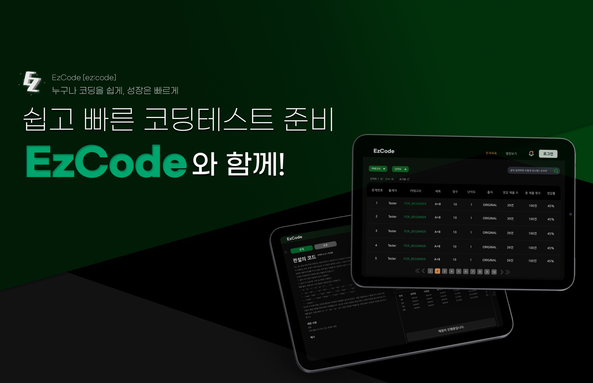
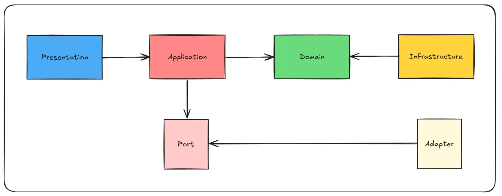
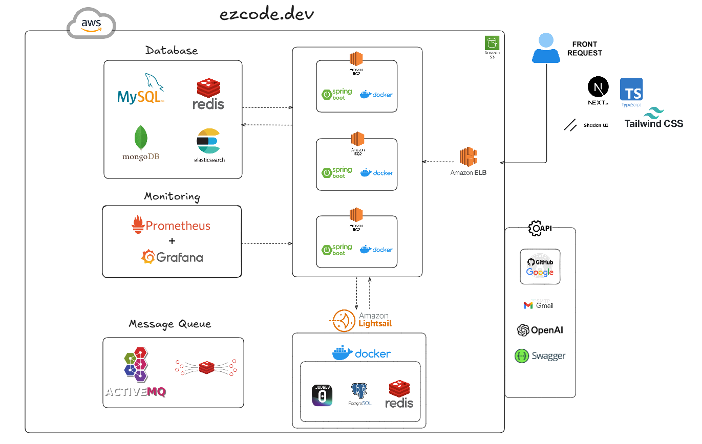
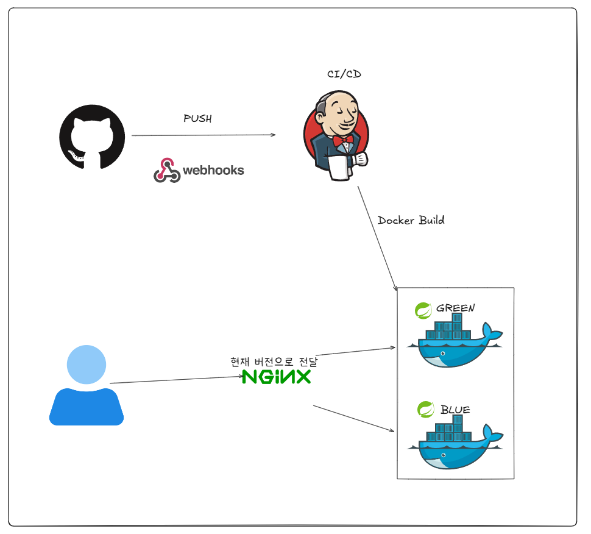

# 📢 EzCode : 코딩 테스트 · AI 코드 리뷰 · 게임화 학습 플랫폼

> **Ezcode**는 채점 그 이상의 가치를 제공하는 개발자 중심 코딩테스트 플랫폼입니다.  
> 단순히 문제를 푸는 것을 넘어서, 지속적인 성장과 동기부여를 설계했습니다.

---

## 👥 팀원 역할

| 이름  | 역할  | 담당 기능                  |
|-----|-----|------------------------|
| 오동원 | 팀장  | 인프라, 신고, 랭킹            |
| 김태익 | 부팀장 | 채점, 코드리뷰, Github 자동 푸시 |
| 김민우 | 팀원  | 문제, 테스트케이스             |
| 임민지 | 팀원  | 유저, 메일, 디자인            |
| 유승우 | 팀원  | 커뮤니티, 알림               |
| 박경오 | 팀원  | 게임, 채팅, 문제 검색 엔진       |

---
## 🚀 주요 특징

### ✅ 매일 한 문제씩, 꾸준히 실력 향상
- 실시간 채점 및 AI 코드 리뷰 제공
- GitHub 자동 연동으로 코드 관리 용이
- 캐릭터 성장과 랭킹 시스템을 통한 학습 동기 부여

---

## 🛠️ 주요 기능

### 👥 유저 서비스
- **회원가입/로그인**
    - 이메일 및 비밀번호, 소셜 로그인(Google, GitHub)
- **마이페이지**
    - 개인정보, 랭킹, 문제 현황, 프로필 이미지 관리
- **메일 인증**
    - 회원가입 시 인증 및 비밀번호 재설정 링크 제공
- **회원 탈퇴**
    - Soft Delete 방식으로 탈퇴 처리

---

### 📓 문제 서비스
- 관리자 전용 문제 등록/수정/삭제
  - 테스트 케이스 (문제에 맞게 입력, 기댓값 정보 포함)
- 카테고리 및 난이도별 필터링, 이미지 포함 문제 제공
- 문제별 점수 및 검색 기능

---

### 🖍️ 채점 및 리뷰
- 병렬 채점 시스템으로 빠른 피드백
- 제출별 테스트 케이스별 결과 확인
- AI 기반 코드 리뷰 제공 (시간 복잡도 분석 등)
- **매주 토큰 지급**: 매일 한 문제를 풀면 보상 증가
- GitHub 레포지토리 자동 푸시 기능

---

### 🎮 게임화 시스템
- 문제 풀이 시 캐릭터 성장 (레벨/포인트)
- 캐릭터 능력치, 아이템, 스킬 확인 가능
- **PVP, 어드벤처 모드**, 아이템/스킬 뽑기 시스템

---

### 💬 커뮤니티 기능
- 실시간 채팅 및 질문/토론 공유
- 문제 관련 토론 게시판 (정렬 기능 포함)
- 댓글/대댓글 소통 기능

---

### 📮 알림 시스템
- 토론글 추천, 댓글, 대댓글 등 알림 전송

---

## 📂 아키텍처

### ⚙️ 4-Layer Architecture + Port & Adapter Pattern

> 자세한 논의 내용은 아래 링크를 참고하세요:
- [ver1 아키텍처](https://www.notion.so/2012dc3ef51480e88b11fd1d69e9fc40?pvs=21)
- [ver2 아키텍처](https://www.notion.so/ver2-2012dc3ef514801f8e80dab143a11088?pvs=21)
- [ver3 아키텍처](https://www.notion.so/ver3-2022dc3ef51480ecb369f608ae0c3dc6?pvs=21)

### System Architecture

---

## CI/CD

## 💡 기술 스택

| 구분                 | 사용 기술                                                |
|--------------------|------------------------------------------------------|
| **🖥️ 언어**         | Java 17                                              |
| **🔧 백엔드**         | Spring Boot, Spring Data JPA, QueryDSL, Spring Batch |
| **🔐 보안**          | Spring Security, JWT                                 |
| **💾 데이터베이스**      | MySQL, Redis, MongoDB, ElasticCache                  |
| **📨 메시지 큐**       | ActiveMQ, Redis Stream                               |
| **🧠 개발 도구 (IDE)** | IntelliJ IDEA                                        |
| **🌐 외부 API**      | Gmail SMTP, OpenAI, Judge0                           |
| **📚 API 문서화**      | Swagger                           |
| **🧪 테스트 도구**      | Postman, JUnit5, nGrinder                           |
| **☁️ 클라우드 서비스**      | AWS EC2, RDS, S3, LightSail, Cloudflare                           |
| **🚀 배포 도구**      | Jenkins, GitHub Actions, Docker, Nginx                           |
| **📊 모니터링**      | Spring Actuator, Prometheus, Grafana                           |
| **🤝 협업 도구**      | GitHub, Notion, Slack, Discord, jira                 |